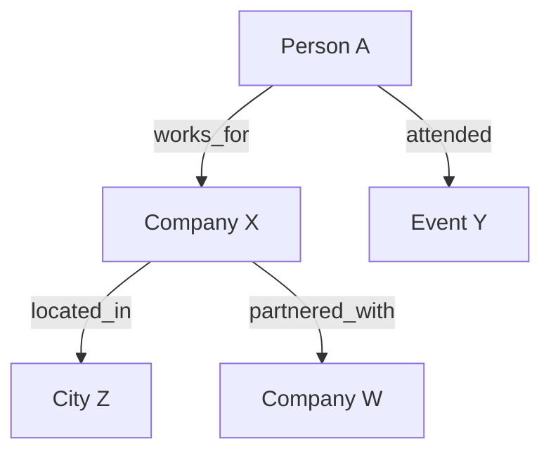

# Knowledge Graph Builder

Extract entities and relationships from news articles and open sources. Build structured knowledge graphs for analysis.

## Core Workflows

### 1. Entity Extraction from Articles
1. Fetch articles from news system:
   `curl -s "http://backend:8000/api/v1/articles?keyword=<topic>&page_size=20&sort_by=publish_time&sort_order=desc"`
2. For each article, get full detail: `curl -s "http://backend:8000/api/v1/articles/<id>"`
3. Extract entities:
   - **People**: names, titles, roles, organizations
   - **Organizations**: companies, agencies, groups
   - **Locations**: cities, regions, countries, facilities
   - **Events**: meetings, incidents, announcements, transactions
   - **Dates**: significant timestamps, deadlines
4. Identify relationships between entities

### 2. Relationship Mapping
For each pair of related entities, document:
- Entity A → Entity B: relationship type (employed_by, located_in, attended, accused_of, owns, partners_with, etc.)
- Source article ID and quote
- Confidence level (confirmed / likely / possible)
- Temporal context (when the relationship was observed)

### 3. Network Analysis
- Count connections per entity (degree centrality)
- Identify bridge entities (connect otherwise separate clusters)
- Find the shortest path between two entities
- Detect clusters / communities

### 4. Building the Graph
Output graph in Mermaid format for visualization:

For larger graphs, use a structured adjacency list.

### 5. News System Cross-Reference
- Search articles mentioning each entity pair together
- Use similar articles to expand entity network
- Check keyword cloud for related terms
- Use timeline data to track entity co-mentions over time

### 6. Temporal Analysis
- Plot entity appearances on timeline
- Track relationship changes over time
- Identify when new connections formed
- Detect anomalies (sudden co-mention spikes)

## Output Format
1. **Entity List**: extracted entities organized by type, with article sources
2. **Relationship Table**: entity pairs, relationship type, source, confidence
3. **Mermaid Graph**: visualization of the network
4. **Key Insights**: central figures, bridges, clusters, anomalies
5. **Timeline**: chronological view of relationship changes
6. **Data Sources**: all article IDs and URLs used
