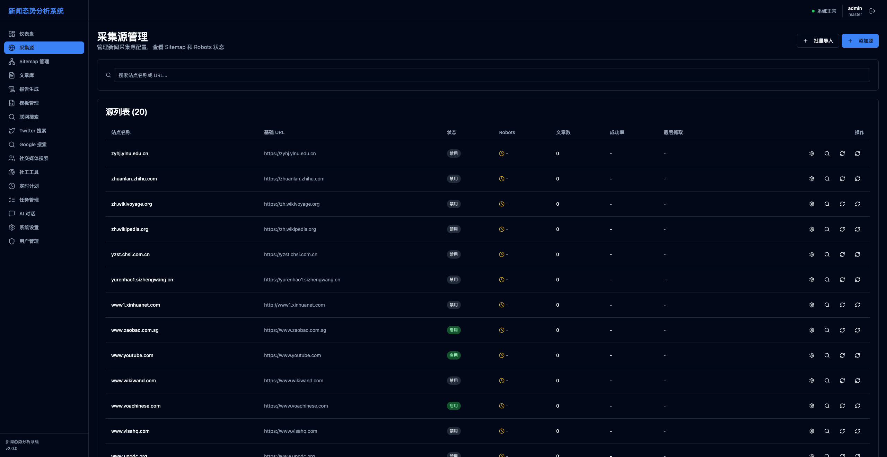
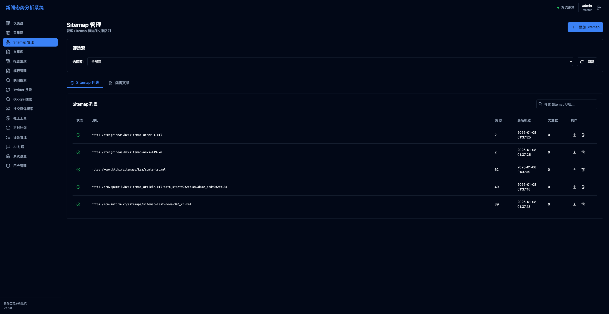
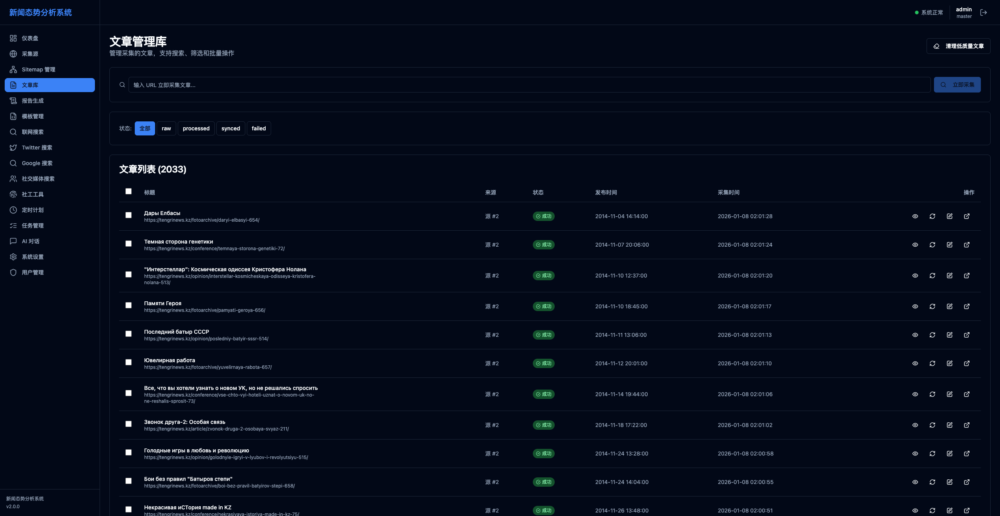

# 新闻态势分析系统 - 用户手册

## 目录

1. [系统概述](#系统概述)
2. [登录页面](#登录页面)
3. [仪表盘](#仪表盘)
4. [采集源管理](#采集源管理)
5. [Sitemap 管理](#sitemap-管理)
6. [文章库](#文章库)
7. [报告生成](#报告生成)
8. [模板管理](#模板管理)
9. [联网搜索](#联网搜索)
10. [Twitter 搜索](#twitter-搜索)
11. [Google 搜索](#google-搜索)
12. [社交媒体搜索](#社交媒体搜索)
13. [社工工具](#社工工具)
14. [定时计划](#定时计划)
15. [任务管理](#任务管理)
16. [AI 对话](#ai-对话)
17. [系统设置](#系统设置)
18. [用户管理](#用户管理)

---

## 系统概述

新闻态势分析系统是一个综合性的新闻采集、分析和报告生成平台。系统提供了从新闻源采集、数据处理、智能分析到报告生成的全流程功能。

**主要功能模块：**
- 数据采集：支持多种新闻源和社交媒体平台的采集
- 内容管理：文章库管理和 Sitemap 管理
- 智能分析：AI 驱动的内容分析和报告生成
- 搜索功能：集成多个搜索引擎和社交平台搜索
- 任务管理：定时任务和实时任务调度
- 系统管理：用户管理和系统配置

**技术特点：**
- 现代化的 Web 界面
- 实时数据更新
- 智能化内容推荐
- 可定制的报告模板

---

## 登录页面

### 页面概述
登录页面是用户进入系统的第一道关卡，用于验证用户身份和权限。

### 页面元素详解

#### 1. 系统标题区
- **标题**："新闻态势分析系统"
- **图标**：锁形图标 🔒
- **说明**：显示系统名称，表明这是安全登录入口

#### 2. 登录提示
- **内容**："请输入用户名和密码登录"
- **说明**：引导用户进行登录操作

#### 3. 用户名输入框
- **标签**：用户名
- **类型**：文本输入框
- **占位符**：请输入用户名
- **功能**：输入系统分配的用户名
- **默认账号**：
  - 管理员：`admin`
  - 办公室用户：`001` ~ `007`

#### 4. 密码输入框
- **标签**：密码
- **类型**：密码输入框（显示为 ••••）
- **占位符**：请输入密码
- **功能**：输入对应的登录密码
- **默认密码**：
  - admin：`admin123`
  - 001：`pass001`
  - 002：`pass002`
  - ...依此类推

#### 5. 登录按钮
- **文本**："登录"
- **样式**：主色调按钮
- **功能**：提交登录信息
- **状态变化**：
  - 初始：可点击
  - 登录中：显示"登录中..."并禁用
  - 成功：跳转到仪表盘
  - 失败：显示错误提示

### 使用流程
1. 输入用户名
2. 输入密码
3. 点击登录按钮
4. 等待验证（成功则自动跳转）

### 权限说明
- **管理员 (admin)**：可访问所有功能，包括用户管理
- **普通用户 (001-007)**：可访问基本功能，无法管理用户

---

## 仪表盘

### 页面概述
仪表盘是系统的控制中心，提供系统整体运行状态的实时监控和关键指标展示，帮助用户快速了解系统健康状况和数据采集情况。

### 页面元素详解

#### 1. 统计卡片区域（4个卡片）

##### 采集源总数卡片
- **图标**：地球图标 🌐
- **主数值**：显示格式"33 / 93"（活跃数 / 总数）
- **副标题**："活跃 / 总数"
- **说明**：展示当前启用的采集源数量和系统配置的采集源总数
- **数据来源**：实时统计

##### 文章总数卡片
- **图标**：文档图标 📄
- **主数值**：显示文章总数，如"2033"
- **副标题**："今日新增: 921"
- **说明**：显示系统中的文章总数和今天新增的文章数量
- **更新频率**：实时更新

##### 失败文章卡片
- **图标**：警告图标 ⚠️（红色）
- **主数值**：失败文章数，如"0"
- **副标题**："需要重试"
- **说明**：显示采集失败需要重试的文章数量，0表示没有失败

##### 存储使用卡片
- **图标**：硬盘图标 💾
- **主数值**：存储使用量，如"0 B"
- **副标题**："数据库大小"
- **说明**：显示数据库占用的磁盘空间

#### 2. 系统健康状态卡片

##### 状态指示
- **标题**："系统健康状态"，附带活动图标
- **状态指示灯**：
  - 绿色圆点：系统正常
  - 黄色圆点：需要注意
  - 红色圆点：严重问题
- **状态文字**：
  - "系统正常"
  - "需要注意"
  - "严重问题"
- **检查时间**：显示最后检查时间，格式"2026/1/8 02:01:55"

##### 健康指标
- **待处理文章**：当前等待处理的文章数量
- **重试队列**：等待重新采集的文章数量
- **24h 失败率**：
  - 显示格式："24h 失败率: 0%"
  - 正常：黑色文字
  - 超过20%：红色文字警示
- **更新机制**：每30秒自动刷新

#### 3. 热门采集源（本周）卡片

##### 卡片头部
- **标题**："热门采集源（本周）"
- **查看全部链接**：跳转到采集源管理页面

##### 采集源列表
每个采集源显示：
- **站点名称**：如"Auto-generated from www.kt.kz"
- **文章数**：如"748 篇"
- **成功率进度条**：
  - 可视化进度条（蓝色）
  - 百分比数值："成功率: 0%"
- **排序规则**：按本周采集文章数降序排列

#### 4. 关键词词云卡片

##### 卡片标题
- **标题**："关键词词云"

##### 四个词云面板（2x2布局）
- **本周中文**：显示本周中文文章的关键词统计，暂无数据时显示"暂无数据"
- **本周哈萨克语**：显示本周哈萨克语文章的关键词统计
- **本月中文**：显示本月中文文章的关键词统计
- **本月哈萨克语**：显示本月哈萨克语文章的关键词统计
- **说明**：词云大小表示关键词出现频率

#### 5. 快捷操作卡片

##### 快捷按钮（4个）
- **添加采集源**：跳转到 /sources 页面
- **批量重试失败文章**：跳转到 /articles 页面
- **生成新报告**：跳转到 /reports 页面
- **联网搜索**：跳转到 /search 页面

### 数据刷新机制
- **统计卡片**：页面加载时获取
- **健康状态**：每30秒自动刷新
- **热门采集源**：基于最近7天数据
- **关键词词云**：实时更新

### 使用场景
- **日常监控**：登录系统后第一时间查看仪表盘，了解系统运行状态
- **问题诊断**：通过健康状态和失败率指标快速发现系统问题
- **数据概览**：通过统计卡片了解数据采集进度
- **快速导航**：使用快捷操作按钮快速跳转到常用功能

---

## 采集源管理

### 页面概述
采集源管理页面用于配置和管理新闻采集源，支持查看Sitemap和Robots状态，控制采集源的启用/禁用，以及手动触发采集任务。

### 页面元素详解

#### 1. 页面标题和操作区

##### 页面标题
- **主标题**："采集源管理"
- **副标题**："管理新闻采集源配置，查看 Sitemap 和 Robots 状态"

##### 操作按钮
- **批量导入按钮**：
  - 图标：➕
  - 文本："批量导入"
  - 功能：打开批量导入对话框，一次性导入多个采集源
  - 样式：轮廓按钮（灰色边框）

- **添加源按钮**：
  - 图标：➕
  - 文本："添加源"
  - 功能：打开添加采集源对话框
  - 样式：主色调按钮

#### 2. 搜索卡片

##### 搜索区域
- **搜索图标**：🔍（灰色，视觉提示）
- **搜索输入框**：
  - 占位符："搜索站点名称或 URL..."
  - 功能：实时过滤采集源列表
  - 搜索范围：站点名称和基础URL
  - 即时过滤：输入时立即生效

#### 3. 采集源列表

##### 列表头部
- **标题**："源列表 (20)"
- **说明**：显示当前采集源总数

##### 表格列定义

| 列名 | 宽度 | 说明 |
|------|------|------|
| 站点名称 | 自动 | 显示采集源的站点名称 |
| 基础URL | 自动 | 显示采集源的URL地址，超长截断 |
| 状态 | 约80px | 显示启用/禁用状态 |
| Robots | 约80px | 显示Robots.txt状态和延迟 |
| 文章数 | 约80px | 显示采集文章总数 |
| 成功率 | 约80px | 显示采集成功率百分比 |
| 最后抓取 | 约120px | 显示最后采集时间 |
| 操作 | 约150px | 操作按钮组 |

##### 表格行内容详解

**站点名称列**：
- 显示内容：如"zyhj.ylnu.edu.cn"
- 字体：正常粗细

**基础URL列**：
- 显示内容：如"https://zyhj.ylnu.edu.cn"
- 颜色：灰色（次要文字颜色）
- 样式：超长时截断并显示省略号

**状态列**：
- **启用状态**：
  - 背景色：浅绿色（深色模式为深绿色）
  - 文字：绿色
  - 文本："启用"

- **禁用状态**：
  - 背景色：浅灰色
  - 文字：灰色
  - 文本："禁用"

**Robots列**：
- **状态图标**：
  - 绿色对钩 ✅：遵守规则（compliant）
  - 红色叉号 ❌：受限（restricted）
  - 红色感叹号 ⚠️：错误（error）
  - 黄色时钟 ⏰：待处理（pending）
  - 灰色对钩：未知

- **延迟时间**：
  - 显示格式："Xs"（如"3s"表示3秒）
  - 无延迟时显示："-""

**文章数列**：
- 显示内容：成功数 + 失败数的总和
- 示例：0 表示没有采集过文章

**成功率列**：
- **计算公式**：成功数 / 总数 × 100%
- **颜色规则**：
  - ≥ 80%：绿色
  - < 80%：红色
- **无数据时**：显示"-"

**最后抓取列**：
- **有数据**：格式化的日期时间
- **无数据**：显示"-"
- **颜色**：灰色

**操作列**：包含4个图标按钮

##### 操作按钮详解

**调试配置按钮**：
- 图标：⚙️ 设置图标
- 功能：打开调试抽屉，查看和编辑详细配置
- 样式：幽灵按钮（透明背景，悬停显示背景）

**查看 Sitemap 按钮**：
- 图标：🔍 搜索图标
- 功能：打开对话框显示Sitemap内容
- 样式：幽灵按钮

**刷新 Sitemap 按钮**：
- 图标：🔄 刷新图标
- 功能：重新获取该源的Sitemap
- 状态变化：
  - 空闲：静态图标
  - 刷新中：图标旋转动画
  - 完成：恢复正常
- 样式：幽灵按钮

**立即抓取按钮**：
- 图标：🔄 刷新图标
- 功能：立即触发该源的采集任务
- 状态变化：刷新中时图标旋转
- 样式：幽灵按钮

#### 4. 分页控制

##### 分页组件（底部）
- **上一页按钮**：
  - 文本："上一页"
  - 状态：首页时禁用（灰色）
  - 功能：跳转到上一页

- **页码显示**：
  - 格式："第 1 / 5 页"
  - 说明：当前页码和总页数

- **下一页按钮**：
  - 文本："下一页"
  - 状态：末页时禁用
  - 功能：跳转到下一页

### Robots 状态详细说明

| 状态 | 图标 | 颜色 | 说明 |
|------|------|------|------|
| compliant | ✅ | 绿色 | 完全遵守 robots.txt 规则 |
| restricted | ❌ | 红色 | 访问受限，有爬取限制 |
| error | ⚠️ | 红色 | 获取 robots.txt 失败 |
| pending | ⏰ | 黄色 | 等待检查 robots.txt |
| unknown | ⚪ | 灰色 | 未知状态 |

### 使用流程

#### 添加新采集源
1. 点击"添加源"或"批量导入"按钮
2. 填写站点信息：
   - 站点名称
   - 基础URL
   - 可选描述
3. 选择关联的采集源（或自动匹配）
4. 点击"保存"
5. 系统自动获取Sitemap和Robots

#### 调试采集源配置
1. 找到要调试的采集源
2. 点击"调试配置"按钮
3. 在右侧抽屉中查看：
   - 详细配置参数
   - 采集日志
   - 错误信息
4. 修改配置参数
5. 点击"保存"应用更改

#### 手动触发采集
1. 找到要采集的源
2. 点击"立即抓取"按钮
3. 等待采集完成（按钮图标旋转）
4. 在"文章库"查看采集结果

#### 筛选采集源
1. 在搜索框输入站点名称或URL
2. 列表自动过滤显示匹配结果
3. 清空搜索框恢复完整列表

### 数据加载
- **初始加载**：每页显示20条记录
- **加载指示**：首次加载显示旋转动画
- **分页机制**：使用分页按钮切换页面

---

## Sitemap 管理

### 页面概述
Sitemap 管理页面用于管理 Sitemap 和待爬文章队列，支持从 Sitemap 导入文章 URL、批量爬取和重试失败文章，是新闻采集流程的核心管理界面。

### 页面元素详解

#### 1. 页面标题和操作区

##### 页面标题
- **主标题**："Sitemap 管理"
- **副标题**："管理 Sitemap 和待爬文章队列"

##### 添加 Sitemap 按钮
- **图标**：➕ 加号
- **文本**："添加 Sitemap"
- **功能**：打开手动添加 Sitemap 的对话框
- **样式**：主色调按钮

#### 2. 筛选源卡片

##### 卡片内容
- **标题**："筛选源"
- **提示文字**："选择源:"
- **下拉选择框**：
  - 默认选项："全部源"
  - 其他选项：列出所有采集源，格式"站点名称 (URL)"
  - 功能：筛选显示特定源的 Sitemap 和文章
- **刷新按钮**：
  - 图标：🔄
  - 文本："刷新"
  - 功能：手动刷新 Sitemap 列表和待爬文章统计

#### 3. Tab 切换区域

##### Tab 按钮

**Sitemap 列表 Tab**：
- **图标**：🌐 地球图标
- **文本**："Sitemap 列表"
- **功能**：切换到 Sitemap 管理视图
- **状态**：激活时显示下划线和主色调

**待爬文章 Tab**：
- **图标**：📄 文档图标
- **文本**："待爬文章"
- **徽章**：显示待处理文章数量（如有）
- **功能**：切换到待爬文章队列视图

#### 4. Sitemap 列表视图

##### 搜索栏
- **搜索图标**：🔍（灰色）
- **搜索输入框**：
  - 占位符："搜索 Sitemap URL..."
  - 功能：实时过滤 Sitemap 列表

##### Sitemap 表格

**表格列定义**：

| 列名 | 宽度 | 说明 |
|------|------|------|
| 状态 | 64px | Sitemap 获取状态图标 |
| URL | 剩余空间 | Sitemap 的完整 URL |
| 源 ID | 96px | 关联的采集源 ID |
| 最后抓取 | 128px | 最后获取时间 |
| 文章数 | 96px | 包含的文章数量 |
| 操作 | 128px | 操作按钮组 |

**表格行内容**：

**状态列**：
- ✅ 绿色对钩：成功获取
- ❌ 红色叉号：获取失败
- ⏰ 黄色时钟：等待获取
- ⚠️ 红色感叹号：获取错误

**URL 列**：
- 显示完整的 Sitemap URL
- 字体：等宽字体（便于识别）
- 颜色：正常文字颜色

**源 ID 列**：
- 显示数字 ID
- 示例："2"、"62"

**最后抓取列**：
- 格式："2026-01-08 01:37:25"
- 无数据时显示"-"

**文章数列**：
- 显示该 Sitemap 包含的文章数量
- 示例："0"、"748"

**操作列**：

**导入文章到待爬表按钮**：
- 图标：📥 下载图标
- 功能：解析 Sitemap 并将文章 URL 导入待爬队列
- 样式：幽灵按钮
- 大小：32×32px

**删除按钮**：
- 图标：🗑️ 删除图标
- 功能：删除该 Sitemap 记录
- 确认：点击后弹出确认对话框
- 样式：幽灵按钮
- 大小：32×32px

#### 5. 待爬文章视图

##### 统计信息栏

**统计项**（横向排列）：
- **总计**：显示待爬文章总数
- **待爬**：黄色，显示状态为"pending"的数量
- **已完成**：绿色，显示状态为"completed"的数量
- **失败**：红色，显示状态为"failed"的数量
- **遗弃**：灰色，显示状态为"abandoned"的数量

##### 批量操作区域

**信息区域**：
- **当前选中源提示**：
  - 选中源时：显示"当前选中源: 站点名称"
  - 未选中时：显示"全局批量操作"（将处理所有源）
  - 说明文字："（将处理所有源的文章）"

- **每个源数量设置**：
  - 标签："每个源数量:"
  - 输入框：数字输入，范围 1-100
  - 默认值：10
  - 实时统计：显示"待爬: X \| 失败: X \| 遗弃: X"

**批量操作按钮**：

**爬取/全局爬取按钮**：
- **文本内容**：
  - 选中源时："爬取 (10)"
  - 未选中时："全局爬取"
- **图标**：📥 下载图标
- **功能**：
  - 选中源：爬取指定源的待爬文章
  - 未选中：爬取所有源的待爬文章
- **状态变化**：
  - 空闲：主色调按钮
  - 运行中：显示加载动画，按钮禁用
- **禁用条件**：
  - 没有待爬文章时
  - 正在运行其他操作时

**重试失败按钮**：
- **文本**："重试失败 (X)"，X 为失败文章数
- **图标**：🔄 刷新图标
- **功能**：批量重试失败的文章
- **状态变化**：运行时显示加载动画
- **禁用条件**：没有失败文章时

##### 实时进度显示

**进度条容器**（仅在进行批量操作时显示）：
- **背景色**：浅蓝色背景（深色模式为深蓝色）
- **边框**：蓝色边框

**进度信息**：

**左侧**：
- 加载动画：蓝色旋转图标
- 操作类型："批量爬取中" 或 "批量重试中"
- 分隔符："|"
- 当前状态：显示正在处理的源或进度信息

**右侧统计**：
- **批量爬取时**：
  - 成功：绿色，"成功: X"
  - 失败：红色，"失败: X"
  - 跳过：灰色，"跳过: X"
  - 源进度："源: X/Y"，X 为当前源索引，Y 为总源数

- **批量重试时**：
  - 成功：绿色，"成功: X"
  - 失败：红色，"失败: X"
  - 源进度："源: X/Y"

##### 待爬文章表格

**表格列定义**：

| 列名 | 宽度 | 说明 |
|------|------|------|
| 状态 | 64px | 文章状态图标 |
| 标题 | 剩余空间 | 文章标题和 URL |
| 源 ID | 96px | 采集源 ID |
| 发布时间 | 128px | 文章发布时间 |
| 操作 | 128px | 操作按钮 |

**表格行内容**：

**状态列**：
- ⏰ 黄色时钟：pending（待处理）
- 🔄 蓝色旋转：crawling（爬取中）
- ✅ 绿色对钩：completed（已完成）
- ❌ 红色叉号：failed（失败）
- ⚠️ 灰色感叹号：abandoned（遗弃）

**标题列**：
- **标题行**：
  - 显示文章标题
  - 最多显示80个字符
  - 超长截断并显示省略号
  - 示例："无标题"（如果没有标题）

- **URL 行**：
  - 显示完整 URL
  - 字体：等宽字体
  - 字号：12px（小号）
  - 颜色：灰色
  - 超长截断

**源 ID 列**：
- 显示数字 ID
- 示例："2"、"39"

**发布时间列**：
- 格式化的日期时间
- 示例："2026/01/08 02:00"

**操作列**：

**爬取这篇文章按钮**（仅 pending 状态显示）：
- 图标：📥 下载图标
- 功能：立即爬取该文章
- 样式：幽灵按钮
- 状态：爬取时显示旋转动画

**删除按钮**：
- 图标：🗑️ 删除图标
- 功能：从待爬队列删除该文章
- 确认：点击后弹出确认对话框
- 样式：幽灵按钮

##### 分页控制

**底部信息区域**：

**左侧**：
- 显示范围："显示第 1 - 50 条，共 200 条"
- 说明：当前显示的记录范围

**右侧按钮**：
- **上一页按钮**：
  - 文本："上一页"
  - 禁用条件：第一页时

- **页码显示**："第 1 / 4 页"

- **下一页按钮**：
  - 文本："下一页"
  - 禁用条件：最后一页时

#### 6. 源快速操作卡片

##### 显示条件
选中特定源时显示此卡片

##### 卡片内容
- **标题**："源操作 - {站点名称}"
- **按钮组**：

**从 robots.txt 获取 Sitemap 按钮**：
- 图标：🌐 地球图标
- 文本："从 robots.txt 获取 Sitemap"
- 功能：从该源的 robots.txt 提取 Sitemap URL
- 状态：获取时显示加载动画

**同步 Sitemap 文章按钮**：
- 图标：📥 下载图标
- 文本："同步 Sitemap 文章"
- 功能：同步该源的所有 Sitemap 并导入文章
- 状态：同步时显示加载动画

#### 7. 添加 Sitemap 对话框

##### 对话框元素

**标题**："添加 Sitemap"

**描述**："输入 Sitemap URL，系统会自动匹配或创建对应的源。"

**表单字段**：

**Sitemap URL 输入框**：
- 标签："Sitemap URL"
- 占位符："https://example.com/sitemap.xml"
- 类型：文本输入
- 必填：是

**关联源下拉框**：
- 标签："关联源（可选）"
- 默认选项："自动匹配"
- 其他选项：所有可用采集源
- 功能：手动选择关联的采集源
- 说明：留空则系统自动匹配

**对话框底部按钮**：
- **取消按钮**：关闭对话框，不保存
- **添加按钮**：保存 Sitemap，输入为空时禁用

### 文章状态详细说明

| 状态 | 图标 | 颜色 | 说明 |
|------|------|------|------|
| pending | ⏰ | 黄色 | 等待爬取，在队列中 |
| crawling | 🔄 | 蓝色 | 正在爬取，图标旋转动画 |
| completed | ✅ | 绿色 | 爬取成功 |
| failed | ❌ | 红色 | 爬取失败，可重试 |
| abandoned | ⚠️ | 灰色 | 多次失败后遗弃 |

### 使用场景

#### 场景 1：添加新源的 Sitemap
1. 先在"采集源"页面添加采集源
2. 在"Sitemap管理"页面选择该源
3. 点击"从 robots.txt 获取 Sitemap"
4. 等待系统自动导入所有 Sitemap

#### 场景 2：批量爬取文章
1. 切换到"待爬文章"标签
2. 选择要爬取的源（或保持"全部源"）
3. 设置每个源数量（如 10）
4. 点击"全局爬取"按钮
5. 观察实时进度条和统计信息
6. 完成后在"文章库"查看结果

#### 场景 3：重试失败文章
1. 在待爬文章视图查看失败数量
2. 点击"重试失败"按钮
3. 观察进度条显示重试进度
4. 查看重试成功率统计

#### 场景 4：手动导入 Sitemap
1. 点击"添加 Sitemap"按钮
2. 输入 Sitemap URL
3. 选择关联源（或留空自动匹配）
4. 点击"添加"
5. 系统自动解析并导入文章 URL

### 数据流
1. **Sitemap 获取** → 2. **解析 URL** → 3. **导入待爬队列** → 4. **爬取文章** → 5. **保存到文章库**

---

## 文章库

（继续按此格式编写剩余页面...）

